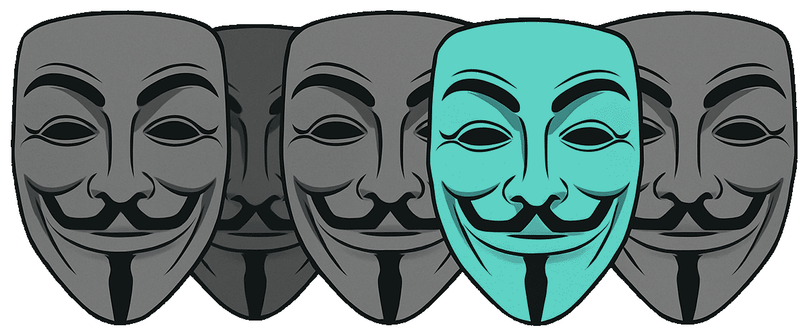

<p align="center">
  
</p>

# Recognition — Face Matcher / Матчер лиц

This project automatically matches guests' selfies with event photos.  
Проект автоматически сопоставляет селфи гостей с фотографиями в фотоотчёте.

## Background / История

This module was originally developed by me in 2024–2025 as part of the SelfieBot project.  
Этот модуль был разработан мной в 2024–2025 как часть проекта SelfieBot.

At some point, the code was stolen and used without attribution.  
В какой-то момент код был украден и использовался без указания авторства.

To make sure it remains free and cannot be locked behind closed doors,  
I decided to publish it under the GPLv3 license.  
Чтобы он навсегда остался свободным и не оказался закрыт в чьих-то руках,  
я решил выложить его под лицензией GPLv3.

Now anyone can use it, extend it and contribute — but only under the same terms of freedom.  
Теперь любой может пользоваться, дорабатывать и вносить вклад — но только в рамках тех же условий свободы.

## Features / Возможности

- Detects and encodes faces in `_SELFIE*.jpg` photos.  
  Поиск и кодирование лиц на селфи.
- Matches detected faces with the full event photo set.  
  Сопоставление лиц с фото из отчёта.
- Copies matching photos into the corresponding selfie folders.  
  Копирование найденных фото в соответствующие папки.
- Optimized resize and embedding cache for speed.  
  Оптимизированный ресайз и кеш эмбеддингов для скорости.
- Parallel processing (CPU‑friendly).  
  Параллельная обработка (бережно к CPU).
- Yandex.Disk integration for uploading/downloading selfies.  
  Интеграция с Яндекс.Диском (загрузка/выгрузка селфи).

## Requirements / Требования

- Script installs everything automatically via [uv](https://github.com/astral-sh/uv).  
  Скрипт сам устанавливает всё необходимое через [uv].
- System packages may be needed: `cmake`, `boost`, `openblas`, `libjpeg`.  
  Может потребоваться установка системных пакетов: `cmake`, `boost`, `openblas`, `libjpeg`.

## Setup / Установка

### Step 1 / Шаг 1: Clone repository

```bash
git clone https://github.com/pavelveter/recognition.git
cd recognition
```

### Step 2 / Шаг 2: Run the program

```bash
./run_recognition.sh
```

## Notes / Заметки

- Only works with JPEG (`.jpg/.jpeg`).  
  Работает только с JPEG (`.jpg/.jpeg`).
- If `images/@selfies` is empty, selfies will be downloaded from Yandex.Disk.  
  Если `images/@selfies` пустая, селфи будут скачаны с Яндекс.Диска.
- Results can be uploaded back to the cloud automatically.  
  Результат можно автоматически выгрузить обратно в облако.

## License / Лицензия

Distributed under [GNU GPL v3](LICENSE).  
Распространяется под лицензией [GNU GPL v3](LICENSE).

Copyright (C) 2025 Pavel Borisov (github.com/pavelveter)
